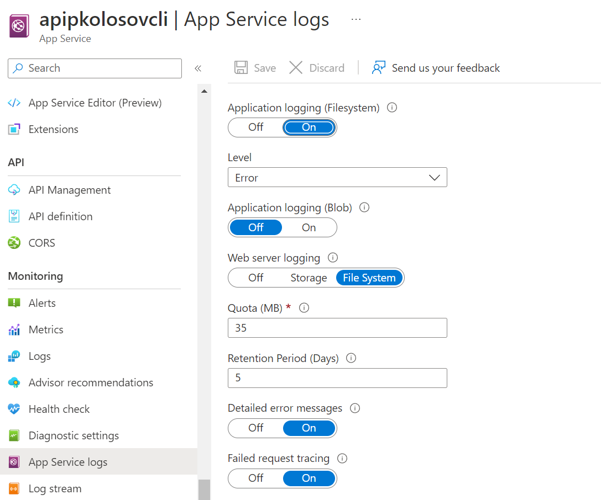

# App Service enable diagnostic logging

[](https://github.com/kolosovpetro/AppServiceLogging.AZ204/actions/workflows/run-build-and-test-dotnet.yml)

Simple and straightforward way to find you debug or error logs at Azure Portal.

## 1. Create App Service using CLI

- Create resource group
    - `$rgName="rg-app-service-cli"`
    - `$location="centralus"`
    - `az group create -n $rgName -l $location`

- Create app service plan
    - `$planName="appserviceplan"`
    - `az appservice plan create -g $rgName -n $planName --sku "F1"`
    - Available values for sku:
        - `B1, B2, B3, D1, F1, FREE, I1, I1v2, I2, I2v2, I3, I3v2, P1V2, P1V3, P2V2, P2V3, P3V2, P3V3, S1, S2, S3, SHARED, WS1, WS2, WS3`

- Check available app service runtimes
    - `az webapp list-runtimes`

- Create app service
    - `$appName="apipkolosovcli"`
    - `$runtime="dotnet:6"`
    - `az webapp create -g $rgName -n $appName --plan $planName --runtime $runtime`

## 2. Build project and create zip archive

- Publish project:
    - `dotnet publish --configuration Release --output .\bin\publish`
- Create zip via powershell:
    - `Compress-Archive .\bin\publish\* .\app.zip -Force`

## 3. Deploy

- Deploy via CLI:
    - `az webapp deployment source config-zip -g $rgName -n $appName --src "app.zip"`

## 4. Enable app service logging Azure Portal



## 5. Install nuget packages and configure startup logging

- `Microsoft.Extensions.Logging.AzureAppServices`
- Configure logging in application

```csharp
var builder = WebApplication.CreateBuilder(args);

builder.Host
    .ConfigureLogging(logging =>
    {
        logging.ClearProviders();
        logging.AddConsole();
        logging.AddDebug();
        logging.AddAzureWebAppDiagnostics();
    })
    .ConfigureServices(services =>
    {
        services.Configure<AzureFileLoggerOptions>(options =>
        {
            options.FileName = "my-azure-diagnostics-";
            options.FileSizeLimit = 50 * 1024;
            options.RetainedFileCountLimit = 5;
        });
    });
```


